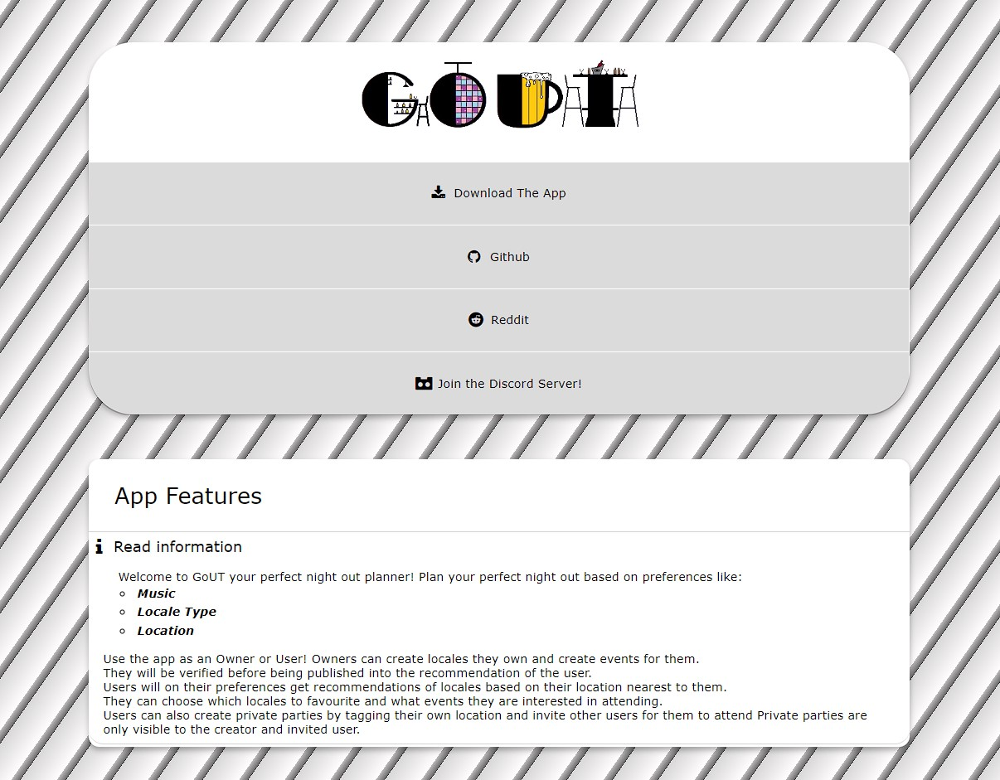

<h2 align="center">Application Promotion Website</h2>

A non-framework built website containing pure CSS and HTML with no Javascript involved. The website was created in a couple days, mainly due to me figuring out how to animate certain elements. 

This single page website contains 4 list elements that are links to the information of the application, and are designed in such a way to maintain simplicity.  I also added a section 
for the app information/introudcution so that users can check-out what they're about to download. 
 
This whole project was fun to make, and i enjoyed the two days that i developed this, 
 had my fair share of fun.

 <h2 align="center">Preview Website</h2>
 

 <h2 align="center">Languages Used</h2>
 
  

<h2 align="center">Credits/Inspiration</h2>
  
https://zunjae.github.io/anymeapp.com/  
https://www.w3schools.com/icons/fontawesome_icons_intro.asp

